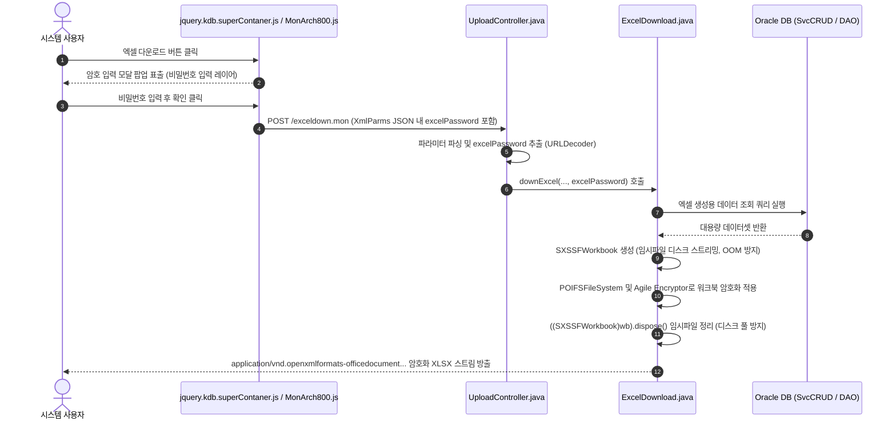
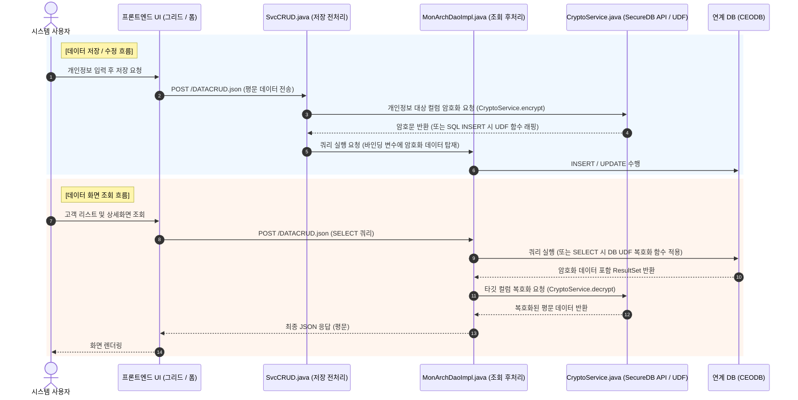

# SERICEO CRM (MonArch 8.2.0) 시스템 아키텍처 상세 정의서

본 문서는 SERICEO CRM 시스템의 백엔드, 프론트엔드, 메타데이터 동적 SQL 엔진, 데이터 통신 및 배치/보안 구조를 상세히 정의한 기술 아키텍처 명세서입니다.

---

## 1. 시스템 개요 및 런타임 스펙

* **시스템 명칭**: SERICEO CRM
* **엔진 프레임워크**: MonArch 8.2.0 (Custom Enterprise CRM Framework)
* **빌드/의존성 구조 (매우 중요)**: Maven/Gradle 등 자동화된 빌드 도구(`pom.xml` 등)를 **사용하지 않는** 고전적인 `Dynamic Web Project` 방식입니다. 모든 외부 라이브러리는 `WebContent/WEB-INF/lib` 폴더에 직접 `.jar` 파일을 복사하여 관리합니다.
* **WAS / Runtime**: Apache Tomcat 9 / JDK 11 (`temurin64-11.0.21`)
* **핵심 라이브러리 (AS-IS 및 TO-BE 고도화 목표)**:
  * Spring Framework `3.1.1.RELEASE` ➡️ **(Task 1: `4.3.30.RELEASE` 업그레이드 예정)**
  * Apache Commons DBCP 1.3 / Commons Pool 1.6
  * Jackson JSON 1.9.7 (`MappingJacksonJsonViewEx`)
  * Apache POI `3.8` ➡️ **(Task 2, 1: 엑셀 다운로드 암호화 및 보안 강화를 위해 `4.1.2` 세트로 교체)**
  * Quartz Scheduler 1.8.3 (배치 및 다이렉트 메일 발송)
  * Jasypt 1.9.1 (데이터베이스 접속 암호화 `PEBEncrytor`)
  * Log4j 1.2.16 (코드 수정 리스크가 커서 **업그레이드 금지**)
  * 보안/암호화 (신규): **(Task 3: KSign SecureDB Java API V2 및 UDF 연동 모듈)**
* **프론트엔드 (AS-IS 및 TO-BE)**:
  * jQuery `1.10.2` ➡️ **(Task 1: 화면 렌더링 호환성 유지를 위해 `1.12.4`로 업그레이드 예정)**
* **데이터베이스 및 인프라 연동 환경**:
  * **CRM 자체 DB (`MICRODEV` / `MICRODB`)**:
    * 개발 DB: `MICRODEV` (`182.198.77.11:1621:MICRODEV`, 계정: `crm`)
    * 운영 DB: `MICRODB` (`192.168.147.156:1621:MICRODB`, 계정: `crm`)
    * **보유 테이블**: 시스템 구동 필수 메타(`M_SERVICE`, `M_STRUCTURE`), 사용자/권한/메뉴(`M_USER`, `M_ROLE`, `M_MENU` 및 매핑 테이블), 공통코드(`M_COMM_CODE`), 다국어 라벨(`M_COMM_LABEL`) 등 시스템 필수 관리 테이블
  * **연계 기간계 DB (`CEODBDEV` / `CEODB`)**:
    * 개발 DB: `CEODBDEV` / 운영 DB: `CEODB`
    * **보유 테이블**: **실제 메인 고객 테이블 및 비즈니스 핵심 원천 데이터**가 위치하며, 트리거(Trigger) 또는 DB Link를 통해 CRM과 연동됨. (개인정보 암/복호화 대상 테이블 위치)
  * **멀티 테넌트 사이트 구분 체계 (`GSITE`)**:
    * `CEO`(기본), `PRO`, `MS` 등 `GSITE` 코드값으로 사이트별 테마/화면/데이터 접근 권한을 분기하는 구조.

---

## 2. 전체 요청 / 응답 라이프사이클 (Request Lifecycle)

```
[클라이언트 브라우저 (jQuery 1.10.2 / 1.12.4)]
       │
       │ 1. AJAX 통신 (URL: /DATACRUD.json, HTTP POST)
       │    페이로드: { service: "...", method: "LIST", params: { ... }, UID: "...", USITE: "...", GSITE: "..." }
       ▼
[DispatcherServlet ("Monarch820", web.xml)]
       │
       │ 2. 인터셉터 검증
       ▼
[LoginCheckInterceptor]
       │  - 세션 내 UserInfo 존재 여부 체크
       │  - 세션 만료 시 AuthException ("로그아웃 되었습니다.") 반환
       ▼
[SvcCRUD Controller (@RequestMapping("/DATACRUD"))]
       │
       │ 3. 메타데이터 조회 (M_SERVICE, M_STRUCTURE)
       ├─► [DB] M_SERVICE 테이블에서 SQL 쿼리 및 실행 메타데이터(ServiceInfo) 취득
       ├─► [DB] M_STRUCTURE 테이블에서 화면 구조체(UI JSON) 메타데이터 취득 (프론트 렌더링용)
       │
       │ 4. 동적 SQL 및 필터 조립
       ├─► FilterGenerator : 그리드 검색 조건 및 멀티 필터 WHERE 절 생성
       ├─► QueryGenerator : DB 종류별 문법(Oracle ROWNUM 페이징, SYSDATE 등) 조립
       │
       │ 5. 파라미터 매핑 및 SQL 실행
       ▼
[MonArchDaoImpl (extends DataSourceSupport)]
       │  - 정규식(@+[ a-zA-Z0-9가-힣-_ ]*@)을 통해 @PARAM@ 토큰 추출
       │  - NamedParameterJdbcTemplate 또는 PreparedStatement 파라미터 바인딩
       │  - Oracle LOB 처리 (OracleLobHandler)
       ▼
[Oracle Database (MICRODB / CEODB)]
       │
       │ 6. 결과 셋 반환
       ▼
[ResultInfo Bean 조립]
       │
       ▼
[MappingJacksonJsonViewEx] ──► 클라이언트로 JSON 응답 반환
```

---

## 3. 핵심 비즈니스 데이터 흐름도 (Mermaid Data Flow Diagram)

### 1) 엑셀 다운로드 암호화 파이프라인


### 2) 개인정보 DB 암/복호화 흐름도 (CEODB 연동)


---

## 4. 프론트엔드 아키텍처 (`WebContent/`)

### ① SPA 기반 메인 컨테이너 (`WebContent/ui/monform.jsp`)
* 단일 JSP 화면 안에서 전체 CRM 뷰가 전환되는 **SPA(Single Page Application) 컨테이너 구조**.
* **해시 네비게이션**: `$(window).hashchange(...)` 이벤트를 감지하여 브라우저 히스토리(뒤로가기/앞으로가기) 및 서브 뷰 전환(`historyBackProc()`).
* **테마 시스템**: `Theme_CEO.css`, `Theme_PRO.css`, `Common.css` 등을 동적으로 스위칭하는 테마 엔진 내장.
* **컴포넌트 블로킹**: `$.blockUI`, `qtip` 등을 활용한 로딩 처리 및 팝업 툴팁 관리.

### ② 프론트엔드 4대 핵심 엔진 파일 구조 및 역할

```
[1. Resource.js] (최상위 전역 환경 & 메타 정의)
       │ - _M 전역 객체 선언 (UI 데이터타입, 세션 스키마, 백엔드 서비스 URL 맵)
       ▼
[2. jquery.kdb.MonArch800.js] (공통 기반 유틸리티 & 베이스 UI)
       │ - 쿠키($.cookie), 숫자/날짜 포맷팅, 기본 유틸리티, 팝업/다이얼로그 기본 베이스
       ▼
[3. jquery.kdb.superContaner.js] (화면 렌더링 & 컴포넌트 총괄 엔진 - 16,515줄)
       │ - SuperTable (고급 동적 데이터 그리드: 정렬, 페이징, 멀티 체크박스, 컬럼 리사이징)
       │ - 동적 폼 생성기 (JSON 스키마 기반 CREATE/READ/UPDATE 입력폼 자동 렌더링)
       │ - 9대 분할 레이아웃 총괄 (Flowtop, LeftMainList, MainList, MainView 등 윈도우 관리)
       │ - 액션 디스패처 (.ActionCmd, jobClick 이벤트 수집)
       ▼
[4. jquery.kdb.soap.2.0.js] (백엔드 전담 통신 관문 - Communication Bridge)
       │ - JSONClientParameters (세션 정보 + 폼 데이터 단일 JSON 직렬화)
       │ - PostJsonData() (백엔드 /DATACRUD.json 으로 AJAX POST 전송)
       │ - 공통 에러 파싱 (오라클 ORA-20000 커스텀 예외 메시지 추출, E1000 세션 만료 자동 로그아웃)
       ▼
[백엔드 관문 : SvcCRUD.java]
```

### ③ 프론트-백엔드 2대 통신 축 (`GETJSON` & `PostJsonData`)

| 통신 함수 (JS) | 연계 메타 테이블 (DB) | 백엔드 진입점 (Java) | 주요 역할 및 라이프사이클 |
| :--- | :--- | :--- | :--- |
| **`GETJSON`**<br>(`soap.2.0.js` L.209) | **`M_STRUCTURE`** | `SvcCRUD.java` (`/GetJs`) | **[1단계: 화면 뼈대 그리기]**<br>• 그리드 컬럼 명칭, 헤더 구조, 입력 폼 컴포넌트, 정렬 등 화면 UI 메타데이터(`STRUCTURE_CONT`) 수신 및 캐싱(`_M.Jsons`). |
| **`PostJsonData`**<br>(`soap.2.0.js` L.48) | **`M_SERVICE`** | `SvcCRUD.java` (`/DATACRUD`) | **[2단계: 실제 비즈니스 데이터 CRUD]**<br>• `M_SERVICE` 등록 쿼리(`QUERY_STMT`)에 파라미터를 매핑하여 실행 후 콜백(`ScCallBack`)으로 JSON 데이터 전달. |

---

## 5. 전체 주요 파일 목록 및 상세 용도 (시스템 파일 사전)

### 1) 파일/엑셀 제어 레이어 (`co.kr.kydbm.core.filecontrol`)
| 파일명 | 역할 및 세부 용도 |
| :--- | :--- |
| **`UploadController.java`** | **엑셀 다운로드 및 파일 업로드 메인 컨트롤러**.<br>• `/exceldown` 요청을 받아 `XmlParms` 파라미터(사용자 비밀번호 포함)를 파싱하고 `ExcelDownload` 호출.<br>• 첨부파일 업로드/다운로드, 임시 파일 관리 및 실행 로그 기록. |
| **`ExcelDownload.java`** | **실제 엑셀 파일 생성 및 브라우저 다운로드 스트림 출력 클래스**.<br>• `downExcel()`: SXSSFWorkbook 대용량 시트 생성 및 POIFS Agile 암호화 스트림 방출 (※ Task 2 핵심 대상). |
| **`ExcelDownload2.java`** | `ExcelDownload`의 확장/보조 엑셀 다운로드 클래스. |
| **`CommonExcelUpload.java`** | 엑셀 파일 업로드 시 파일 파싱 및 데이터 유효성 검증 공통 모듈. (POI 4.x 호환 점검 대상) |
| **`UploadDataController.java`**<br>**`UploadDataService.java`** | 대용량 엑셀 데이터를 읽어 DB 테이블로 일괄 업로드(Batch Insert)하는 컨트롤러 및 서비스. |

### 2) 비즈니스 서비스 & 컨트롤러 레이어 (`co.kr.kydbm.core.service` 외)
| 파일명 | 역할 및 세부 용도 |
| :--- | :--- |
| **`SvcCRUD.java`** | **모나크 프레임워크의 메인 심장부 (데이터 CRUD 컨트롤러)**.<br>• `/DATACRUD.json`, `/extSvc` 클라이언트 요청을 총괄 처리.<br>• `M_SERVICE` 메타에서 쿼리를 가져와 실행하며, `GSITE`, `USITE`, 사용자 세션을 바인딩. |
| **`LoginController.java`** | 사용자 로그인 인증, 세션(`UserInfo`) 생성 및 로그아웃 처리 컨트롤러. |
| **`SsoLoginService.java`** | 사내 인트라넷 및 기간계 통합 인증(SSO) 토큰 검증 로그인 처리. |
| **`MailServiceController.java`** | 개별 다이렉트 이메일 발송 및 발송 상태(`MAIL_MGMT`) 관리. |

### 3) 데이터 액세스 레이어 (`co.kr.kydbm.core.dao`)
| 파일명 | 역할 및 세부 용도 |
| :--- | :--- |
| **`MonArchDao.java`**<br>**`MonArchDaoImpl.java`** | **모나크 메인 DAO (동적 SQL 실행기)**.<br>• `M_SERVICE` 쿼리문(`QUERY_STMT`)을 Spring `NamedParameterJdbcTemplate`으로 바인딩 및 실행.<br>• 개인정보 복호화 후처리 및 조회 쿼리 실행 전담. |
| **`MonArchExtDaoImpl.java`** | 확장 비즈니스 로직 및 특수 쿼리 처리를 위한 보조 DAO. |
| **`DataUploadDaoImpl.java`** | 엑셀 대용량 일괄 등록 시 성능 최적화된 배치 쿼리 실행 DAO. |
| **`DataSourceSupport.java`** | 다중 데이터소스 및 DB 커넥션 풀(DBCP) 동적 전환 관리 지원 클래스. |

### 4) 공통 및 유틸리티 레이어 (`co.kr.kydbm.common` & `core.utils`)
| 파일명 | 역할 및 세부 용도 |
| :--- | :--- |
| **`CommonExcelUtil.java`** | **엑셀 셀 파싱 유틸**.<br>• 엑셀 셀 포맷 판별. POI 3.8 정수 상수를 POI 4.1.2 `CellType` Enum으로 마이그레이션 대상. |
| **`FilterGenerator.java`** | 화면 그리드의 다중 조건 검색 필터 SQL 생성기. (암호화 컬럼 검색 시 NTS 토큰 UDF 래핑) |
| **`QueryGenerator.java`** | 오라클/MariaDB 등 DB 종류에 맞는 함수(NVL 등)를 조합하는 동적 쿼리 빌더. |
| **`PEBEncrytor.java`** | DB 접속 정보(JDBC URL, PW) Jasypt PBE 암복호화. |
| **`CommonConst.java`** | 시스템 전역 상수 정의 (DB_TYPE, 화이트리스트 확장자, 공통 에러코드 등). |
| **`CommonUtil.java`** | 날짜 변환, 문자열 포맷팅, 파일명 변환 등 공통 헬퍼 메서드 모음. |

### 5) 스케줄러 배치 레이어 (`co.kr.kydbm.scheduler.job`)
| 파일명 | 역할 및 세부 용도 |
| :--- | :--- |
| **`SendDirectMailJob.java`** | 예약된 대량 DM(Direct Mail) 30초 주기 자동 분할 발송 배치. |
| **`MonarchCommonJob.java`** | 부서 동기화 등 주기적인 ERP/외부 시스템 연동 배치 수행. |
| **`OracleToMariaDBJob.java`**| 이기종 DB(Oracle -> MariaDB) 간 데이터 동기화/마이그레이션 배치. |

---

## 6. 서버 기동 및 캐싱 (`Initializer.java`)

WAS(Tomcat) 구동 시 `Monarch820-servlet.xml`의 `init-method="init"`에 의해 [`Initializer`](file:///c:/Users/khma7/eclipse-workspace/sericeo_crm/src/co/kr/kydbm/core/meta/Initializer.java)가 실행되어 다음 항목을 메모리에 사전 캐싱합니다:

1. **`MetaCommCode.init()`**: 시스템 공통 코드(`M_COMM_CODE`) 전체 메모리 로드
2. **`MetaCommLabel.init()`**: 화면 다국어 및 라벨 텍스트(`M_COMM_LABEL`) 메모리 로드
3. **`MetaCommMsg.init()`**: 시스템 메시지 및 알림 텍스트(`M_COMM_MSG`) 메모리 로드

---

## 7. 운영 안정성 및 예외 처리를 위한 아키텍처 원칙 (운영 보강)

### 1) [백엔드] SXSSFWorkbook 임시 파일 누수(Disk Full) 방지
* **위험 요소**: 대용량 엑셀 생성을 위해 POI `SXSSFWorkbook`을 사용할 경우, OOM 방지를 위해 디스크에 다수의 임시 파일(`.tmp`)을 생성합니다. 스트림 전송 후 이를 방치하면 서버 디스크 공간 부족(Disk Full) 장애가 발생합니다.
* **아키텍처 원칙**: `ExcelDownload.java` 내의 스트림 전송 블록 `finally` 구문에서 **반드시 `((SXSSFWorkbook)workbook).dispose();`를 명시적으로 호출**하여 엑셀 생성 즉시 임시 파일을 디스크에서 완전 삭제하도록 강제합니다.

### 2) [DB/백엔드] 암호화 컬럼의 '검색 필터(Search)' 대응 원칙
* **위험 요소**: CEODB에서 제공하는 API로 데이터를 암호화하여 저장할 경우, 일반적인 그리드 검색 필터(`%LIKE%`) 부분 일치 검색이 불가능해집니다.
* **아키텍처 원칙**:
  * **SecureDB NTS 토큰 활용**: KSign SecureDB의 NTS UDF(`nts`, `nts_bsh`, `nts_fsh`)를 사용하여 색인 기반의 부분 일치 검색을 지원합니다.
  * **Exact Match(일치 검색) 적용**: NTS 토큰이 적용되지 않은 중요 개인정보는 일치 검색으로 유도하고, WHERE 절 바인딩 전 파라미터 자체를 사전 암호화하여 `=` 조건으로 비교합니다.

### 3) [백엔드] 엑셀 업로드(Import) 기능의 연쇄 에러(Side-effect) 차단
* **위험 요소**: POI 버전을 3.8에서 4.1.2로 상향함에 따라, 엑셀 업로드 모듈(`CommonExcelUpload.java`, `UploadDataController.java`)이 구형 POI 문법에 의존할 경우 런타임 에러가 발생할 수 있습니다.
* **아키텍처 원칙**: 다운로드 암호화 개발 시 `CommonExcelUtil.java` 및 `CommonExcelUpload.java`의 POI 4.x `CellType` 호환성 점검을 필수 테스트 항목으로 병행합니다.
